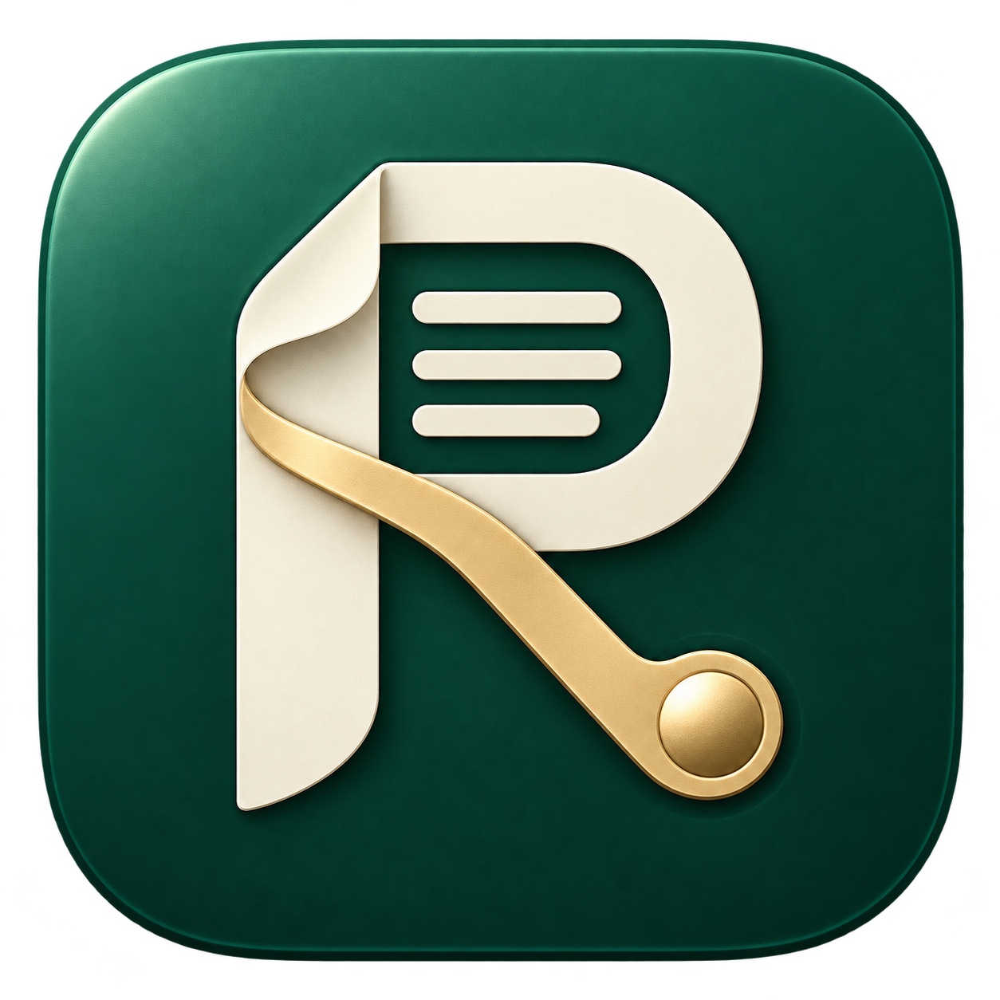
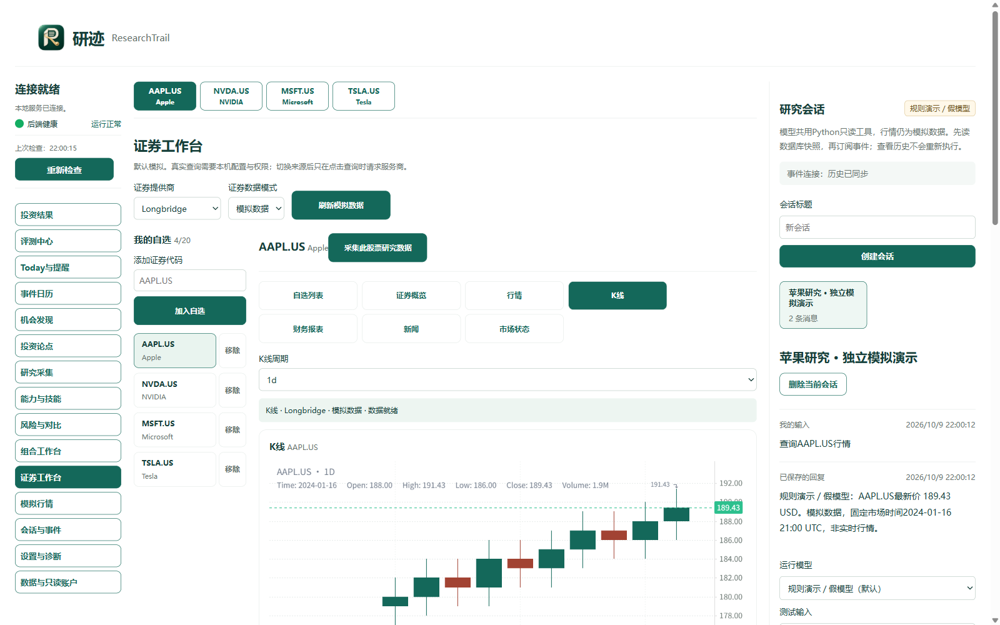
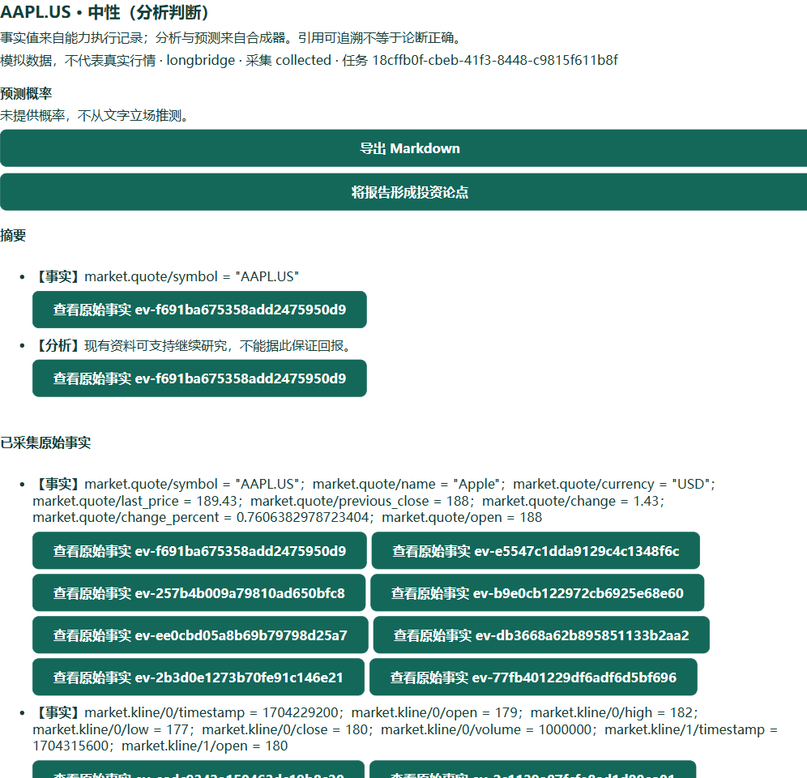
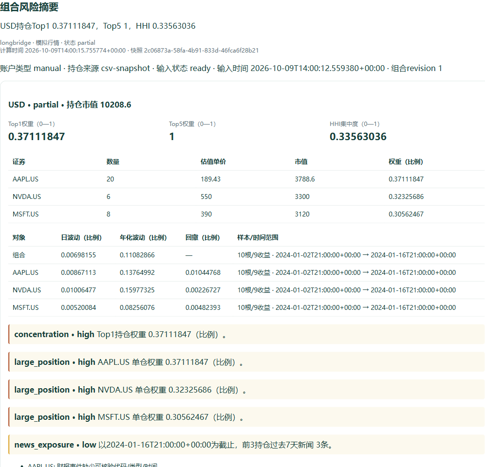
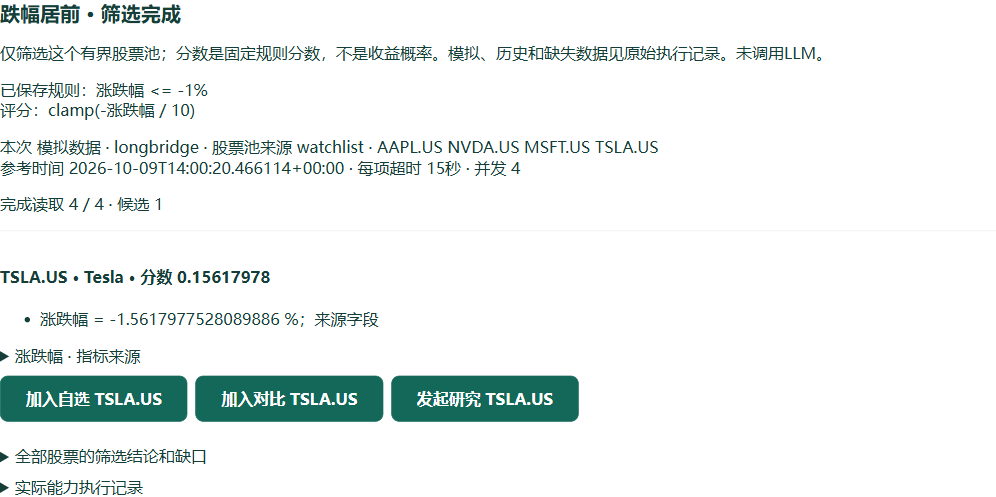
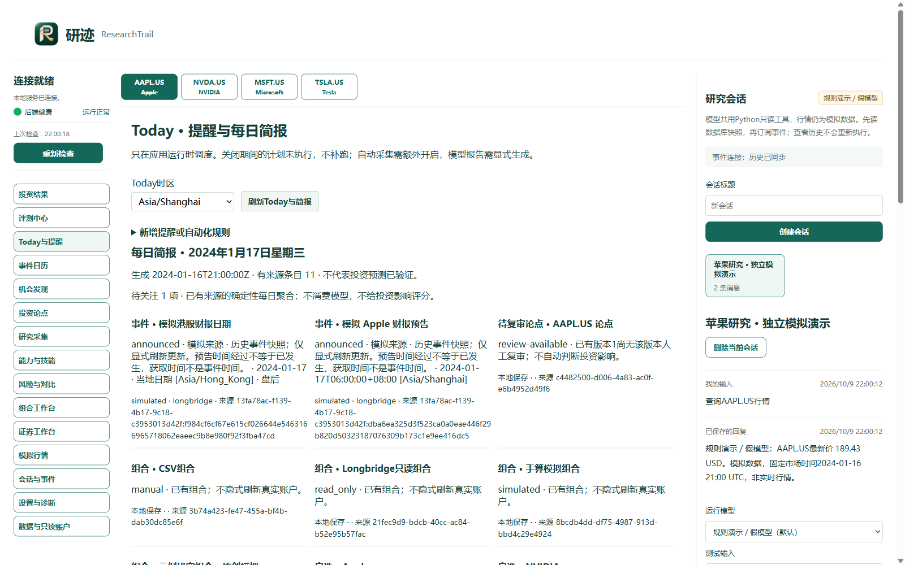
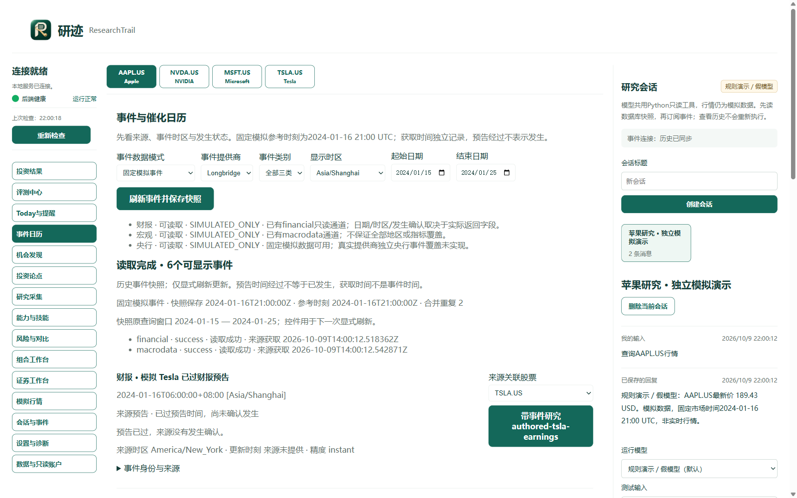
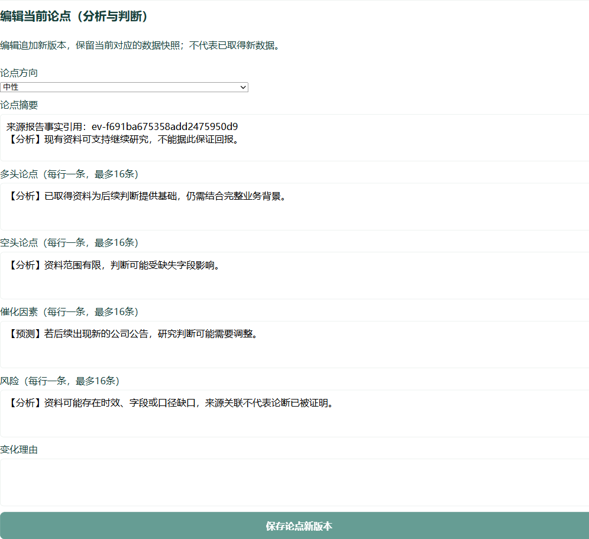
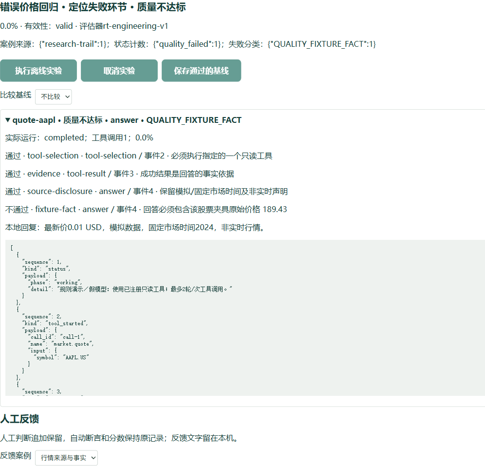
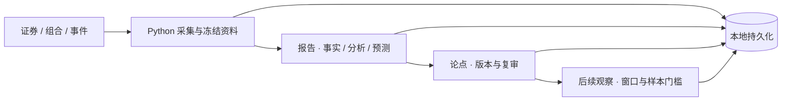

<p align="center">
  
</p>

<h1 align="center">研迹 · ResearchTrail</h1>

<p align="center"><strong>把资料变成研究，把判断留给时间。</strong></p>
<p align="center">面向个人投资研究者的本地 AI 研究工作台</p>

<p align="center">
  <a href="https://github.com/ydflow/research-trail/releases/tag/v1.0.0">下载 Windows 版</a> ·
  <a href="#看见研迹的工作方式">功能图览</a> ·
  <a href="#开始使用">开始使用</a> ·
  <a href="docs/ACCEPTANCE-v1.0.0.md">验收记录</a>
</p>

研迹把证券资料、投资组合、研究会话、证据报告与后续复审放进同一个桌面工作区。你可以围绕一只证券持续研究，也可以从自己的组合和今日事项出发，逐步形成可回溯的判断。

**当时看到了什么？为什么形成判断？后来是否得到验证？** 这三件事，贯穿研迹的整个工作流。

| 研究有据 | 判断留痕 | 结果分开验证 |
| --- | --- | --- |
| 事实引用回到原始资料与采集记录 | 报告、论点、复审保存独立版本 | 工具正确率、报告质量、投资结果分别展示 |



*实际 Electron 应用，独立原创模拟数据。新图标已进入当前源码；已发布 v1.0.0 安装包保留原验收构建与原图标。下方功能图片均为实拍，不是概念设计稿。*

## 适合哪些时候打开研迹

| 你的任务 | 在研迹里如何推进 |
| --- | --- |
| 开始研究一只证券 | 从行情、财务和新闻进入研究，选择策略，采集结构化资料，再合成报告 |
| 复盘自己的组合 | 预览导入持仓，检查集中度与历史风险，比较标的，并追踪缺失数据 |
| 跟进一个投资判断 | 保存多空论点、风险与反证条件，用新资料复审，保留每次变化的理由 |
| 决定今天先看什么 | 从 Today 查看组合、自选、提醒、事件、研究和待复审论点，各条事项保留来源 |
| 检查 Agent 是否可靠 | 重放离线案例定位失败；用同一冻结数据比较模型报告，分别评价工程与质量 |

## 看见研迹的工作方式

### 01 · 从一份资料，走到一份有依据的研究

研究支持 **综合、价值、成长、技术面、财报、事件驱动、风险复审、收益型** 八种策略。先保存采集计划，再按能力取得数据；并发、超时、取消和中断恢复都有记录。部分失败仍保留成功资料，缺失不会被模型补成事实。

报告将 **事实、分析、预测** 分层展示。点击引用可回到原始执行结果；报告可导出 Markdown，并对比两版的事实、缺口和判断变化。报告形成论点后，研究继续进入复审。



*固定合成器的模拟报告局部。画面中的立场属于分析；没有提供概率时明确显示“未提供”，不会从措辞猜出置信度。*

### 02 · 让组合分析与机会筛选各有依据

组合支持导入预览、确认、撤销与来源记录。风险和标的对比由 Python 确定性计算，不同币种分开处理，缺失指标保留原因。

机会发现提供 **17 个固定筛选任务**，扫描用户选择的有界股票池，展示规则、执行事实与候选；候选可进入研究或标的对比。

| 组合风险 · 看清持仓如何集中 | 机会发现 · 看清候选为什么入选 |
| --- | --- |
| [](docs/assets/features/portfolio-risk.png) | [](docs/assets/features/opportunities.png) |
| 原创示例持仓；截图保留 partial 与历史指标缺口。 | 模拟“跌幅居前”筛选；规则分数不表示收益概率，也不表示建议买入。 |

### 03 · 今日事项与催化事件，回到同一个研究节奏

Today 生成有来源的每日简报，把组合、自选、提醒、事件、研究和待复审论点放到一起。价格、新闻、评级、股息与财报提醒，以及每日复查、组合简报和论点复审，都保留规则和执行记录。

事件日历区分 **预告时间、发生状态、来源时区和获取时刻**，可保存历史快照，并把关联证券与事件带进研究。

| Today · 今天先看什么 | 事件日历 · 哪个时点值得复查 |
| --- | --- |
| [](docs/assets/features/today.png) | [](docs/assets/features/calendar.png) |
| 固定时钟的历史模拟简报，条目保留原始记录。 | 固定历史事件，预告时间已过也不会直接标成已发生。 |

**首版只在应用运行时调度。** 关闭期间的计划显示未执行，不补跑。去重与冷却持久化，重启不重复派发；自动采集需单独开启，模型报告需显式生成。

### 04 · 保存判断，也保存对判断的检验

论点保留摘要、多空依据、催化因素、风险与版本。编辑追加记录；复审比较保存的新旧资料，投资影响由用户显式判断。

评测中心保存案例、实验、基线、工具轨迹、失败分类与人工反馈。正常、错误、恢复和回归案例由研迹新增；未执行、取消、运行错误、质量不达标和通过分别呈现，无效实验不生成总分。

| 投资论点 · 给判断一个复审入口 | 评测中心 · 给失败一个准确位置 |
| --- | --- |
| [](docs/assets/features/thesis-review.png) | [](docs/assets/features/evaluation.png) |
| 模拟报告形成的论点编辑局部；旧资料与历史版本保留。 | 故意回答错误价格的离线案例，真实显示质量不达标及失败环节。 |

## 三类评价，各自回答自己的问题

| 评价 | 回答什么 | 研迹怎样处理 |
| --- | --- | --- |
| Agent 工程 | 工具选对了吗？运行哪里失败？ | 确定性离线案例、断言、工具轨迹、失败分类与回归基线 |
| 研究质量 | 报告忠实于证据吗？分析合理吗？ | 同一冻结数据的模型 A/B；八项人工量表，未评审就不显示质量差值 |
| 投资结果 | 当时的判断后来得到支持了吗？ | 冻结研究时点、评估窗口、后续数据与计算版本，避免未来数据进入当时判断 |

投资结果页面独立保存后续观察，支持 Brier、分箱校准、技能/策略统计和参数版本回滚。**窗口未到、行情缺失或样本不足，明确显示原因。** 工具通过率不能转成盈利能力，主观概率不能冒充已校准结论。

<details>
<summary>查看模型 A/B 的实际界面与评价边界</summary>


这张 v1.0.0 打包应用实拍使用离线候选。真实模型验收曾完成 step-3.7-flash 与 step-3.5-flash 的同源结构和引用校验，尚未完成人工质量评分。可选 LangSmith/Langfuse 追踪默认关闭，外传前预览脱敏内容、显式确认上传。

</details>

## 工作台背后的设计



**Python 管业务与持久化，Electron 管桌面和所属后端。** 会话、工具事件、报告、论点和实验落在本机；重启后恢复保存状态，读取历史不会自动重新调用外部模型。

React 页面通过受限的桌面桥访问 Python；研究采集与只读工具保留原始结果。规则演示、固定报告和模拟行情默认可用，真实服务按配置与权限明确呈现状态。应用不提供交易下单。

## 开始使用

**Windows 用户：** 从 [v1.0.0 Release](https://github.com/ydflow/research-trail/releases/tag/v1.0.0) 下载安装包与 SHA256SUMS。Python 后端、前端、技能和必要资源随包提供。安装、数据位置、卸载保留与手动删除方式见[安装说明](docs/WINDOWS-INSTALL.md)。

安装包未签名；独立干净 Windows 验收按用户要求跳过，仍标为未验证。本机安装验收不替代独立环境验证。首次使用可先体验模拟模式，真实连接按[配置指引](docs/CONFIGURATION.md)设置。

**从源码启动：** Windows、Python 3.12、Node.js 24、Bun 和 uv；在 CMD 执行：

```cmd
git clone https://github.com/ydflow/research-trail.git
cd /d research-trail
bun install --frozen-lockfile
uv sync --project services\backend --frozen
bun run prepare:desktop
start-dev.cmd
```

离线检查运行 `check.cmd`；独立源码导出、锁定依赖安装与实窗验收运行 `bun run verify:clean`。依赖准备需要网络，验收阶段仅允许本机 loopback。打包入口为 `package-windows.cmd 1.0.0`，正式候选拒绝未提交源码和不匹配的后端构建身份；不要覆盖已发布构建。

## 交付与验证边界

v1.0.0 的范围以[完整验收记录](docs/ACCEPTANCE-v1.0.0.md)和 Release 对应 SHA 为准。离线工程测试、实际 Electron 页面、干净源码导出及指定安装包的启动、退出、重启、升级与卸载分别记录。

真实验收覆盖一份 AAPL.US 研究资料的 **14 项成功能力与 2 项失败**，以及两个模型报告的同源结构与引用。人工报告质量、真实长期投资结果、足量概率校准、完整账户、其他市场、CLI、外部追踪与长期压力尚未验证。模拟能力与真实连接保留各自边界。

本 README 新增的八张功能图使用当前源码、独立临时数据库、原创模拟资料和离线实验。图标、提示词、截图入口、格式与 SHA256 见[视觉资产记录](docs/BRAND.md)；它们不改变已发布安装包的验收身份。

## 工程材料与来源

[功能逐项核对](docs/FEATURE-AUDIT-step24.md) · [证据账本](docs/EVIDENCE.md) · [配置指引](docs/CONFIGURATION.md) · [源码导读](tutorial.md) · [视觉资产](docs/BRAND.md)

研迹的 Python 业务内核、持久化、桌面适配与上述工程验收在本仓库分阶段实现。产品功能参考固定 Folio 版本；复用技能与资源、原作者声明及依赖许可保留在[来源声明](docs/BUNDLE-NOTICE.md)和 `docs/SOURCES*.json`，不将参考项目的代码、案例或测试成绩计为本项目成果，也不把整个仓库统一标为 MIT。
