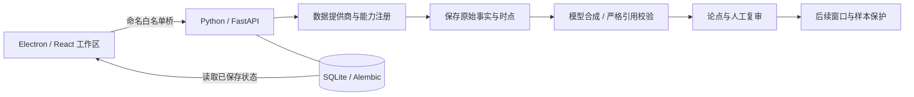

# 研迹 · ResearchTrail

**让投资研究留下证据，而不只留下一段回答。**

研迹是一个运行在 Windows 本机的 AI 投资研究工作台。它把证券资料、组合、自选、研究会话、报告与后续复审放进同一个工作区，让你能回答三件事：**当时看到了什么，为什么形成判断，后来是否得到验证。**

[下载 v1.0.0](https://github.com/ydflow/research-trail/releases/tag/v1.0.0) · [验收记录](docs/ACCEPTANCE-v1.0.0.md) · [安装与数据](docs/WINDOWS-INSTALL.md) · [配置指引](docs/CONFIGURATION.md)

> 本地桌面应用，Python 管业务与持久化，Electron 管桌面和所属后端。默认可用规则演示与模拟行情；接入真实服务后，每份资料仍保留来源和时点。用于研究与复核，不提供下单或收益保证。


*实际 Windows 打包应用（与验收安装包同一构建），截图使用原创隔离模拟数据，不是设计稿或真实账户。*

## 适合哪些时候打开研迹

| 场景 | 你在研迹里做什么 | 留下什么 |
| --- | --- | --- |
| 研究一只证券 | 在证券页查看资料，选研究策略，采集后合成报告 | 逐能力执行记录、成功/缺失资料、事实引用与报告版本 |
| 复盘自己的组合 | 导入持仓，检查风险或对比标的，再打开相关研究 | 导入预览与来源、确定性计算快照、缺失指标说明 |
| 跟进一个判断 | 保存论点、反证和复审条件，观察后续窗口 | 当时依据、版本、评估窗口及实际后续数据 |
| 决定今天先看什么 | 从 Today 汇总跳回组合、自选、提醒、事件和研究 | 每条事项的原始记录，避免只见摘要却找不到出处 |
| 判断 Agent 是否可靠 | 重放离线案例，检查工具轨迹；用同一数据对比两个模型 | 失败所在环节、实验/基线、完整人工量表与历史反馈 |

## 从资料到复审，工作流是连起来的

**采集 → 报告 → 论点 → 复审 → 结果。**

研究支持八种策略入口：综合、价值、成长、技术面、财报、事件驱动、风险复审和收益型。Python 按保存的计划执行有界并发、超时与取消，逐项保存能力结果；部分失败仍保留成功资料，缺失资料不会由模型补成“事实”。你可以恢复采集，也可以明确重新发起，两者都有独立记录。

报告把原始事实、分析和预测分开。引用可以回到能力执行结果，报告可导出 Markdown，并比较事实、缺口、分析与预测概率的变化。可选概率是模型主观预测，未经校准；缺少价格依据、资料时点不合格时拒收，不用“看好”反推一个分数。

论点保存后继续跟进。研究时点、评估窗口、数据与计算版本由 Python 冻结；窗口未到、行情缺失或样本不足就明确显示原因。概率校准使用 Brier 与分箱统计，有效样本不足不画出貌似可信的评价。技能/策略表现和参考权重保留参数版本与回滚；这些统计不会自动替你交易。

## 一个工作区，不同任务有各自入口

- **证券与组合**：自选和常驻资产页签、行情/K线、资料与新闻、持仓导入预览/确认/撤销、组合风险和 2–4 只标的对比。
- **研究与机会**：证券/事件/筛选上下文进入研究，17 个有界筛选任务、带来源的事件日历、研究进度与恢复、报告和论点。
- **Today 与提醒**：组合、自选、提醒、事件、研究、待复审论点六类聚合；每日简报、自动化规则、触发记录、冷却与去重持久化。桌面通知由 Electron 处理。
- **会话与设置**：跨页研究助手、Markdown 回答、工具卡片、可取消运行、持久历史和事件续读；模型/行情/账户各自配置，凭证使用 Windows 系统存储。
- **评测与结果**：案例、实验、基线、工具轨迹和反馈；模型 A/B 使用同一份冻结资料，研究质量与投资结果分别展示。

**应用关闭期间不会常驻调度。** 首版提醒与自动化只在应用运行时执行；未执行任务不会被写成已完成。

## 评测不能只看一个“正确率”

研迹把三种问题分别处理：

| 问题 | 检查方式 | 边界 |
| --- | --- | --- |
| Agent 有没有按契约执行？ | 12 个原创确定性离线案例、工具参数/轨迹、错误与恢复、回归和不可变基线 | 工程正确率不是盈利能力 |
| 报告是不是有用？ | 同一冻结资料的模型 A/B；完整性、事实准确、来源、不确定性、平衡推理、催化条件、期限、决策可用性八项人工评审 | 未执行、取消、错误、未评审没有质量比较分数 |
| 当时的判断后来怎样？ | 冻结研究时点后读取后续行情，计算窗口结果与样本保护下的统计 | 不让未来数据参与当时判断；样本不足保持不足 |

LangSmith/Langfuse 是可选追踪适配，默认关闭。外部上传前有脱敏预览及明确确认；CI 只跑确定性离线评测，不消费真实模型 API。


*实际打包应用页面；此截图为离线演示。真实模型验收结果与人工评审边界见验收记录。*

## 为什么研究历史不会因为刷新而重新执行



Python 是业务状态的唯一管理方。消息和事件先持久化再发送，前端按运行 ID 与事件序号去重；刷新与重读只恢复历史。重启将未完成作业标为中断，不自动补跑模型、工具或研究任务。模型比较在请求开始前保存计数，取消后也不会抹掉可能已经发出的请求。

桌面主进程只管理界面、白名单通信、通知及本次所属 Python 进程。页面不开 Node，后端只监听本机并使用启动令牌；生产包携带前端、Python、迁移、技能、TLS/时区和必要依赖，用户数据库与安装资源分离。

## 下载安装，或从源码运行

Windows x64 安装包与 `SHA256SUMS.txt` 在 [v1.0.0 Release](https://github.com/ydflow/research-trail/releases/tag/v1.0.0)。安装后无需 Python、Node、Bun、uv 或开发仓库。安装器目前未签名；独立干净 Windows 验收按用户要求跳过，实际通过的是开发机安装及受限 PATH、仓库外启动，请据此判断使用范围。

升级前退出应用并备份用户数据。卸载默认保留研究、会话、数据库及系统凭证，重装可读；彻底清除步骤见[数据说明](docs/WINDOWS-INSTALL.md)。

开发环境：Windows x64、Python 3.12、Node.js 24、Bun、uv。CMD：

```bat
git clone https://github.com/ydflow/research-trail.git
cd /d research-trail
bun install --frozen-lockfile
uv sync --project services\backend --frozen
bun run prepare:desktop
start-dev.cmd
```

离线检查运行 `check.cmd`；独立源码导出、锁定依赖安装及实窗验收运行 `bun run verify:clean`。依赖准备需要网络，验收阶段仅允许本机 loopback。打包入口为 `package-windows.cmd 1.0.0`，正式候选拒绝未提交源码和不匹配的后端构建身份。

## 已验证到哪里

v1.0.0 的范围以[完整验收记录](docs/ACCEPTANCE-v1.0.0.md)和 Release 对应 SHA 为准：离线工程测试、实际 Electron 页面、干净源码导出以及指定安装包的 NSIS/启动/退出/重启/升级/卸载测试分别记录。

真实验收覆盖一份 AAPL.US 研究资料的 14 项成功能力与 2 项失败，以及 step-3.7-flash / step-3.5-flash 同源报告的结构与引用校验。真实报告尚未完成八项人工质量评审，没有质量 delta；真实长期收益、足量概率校准、完整账户/其他市场/CLI/外部追踪和长期压力未验证。模拟能力与真实连接不会互相冒充。

## 工程材料与来源

[功能逐项核对](docs/FEATURE-AUDIT-step24.md) · [证据账本](docs/EVIDENCE.md) · [路线](docs/ROADMAP.md) · [源码导读](tutorial.md)

研迹的 Python 业务内核、持久化、桌面适配与上述工程验收在本仓库分阶段实现。产品功能参考固定 Folio 版本；复用技能与资源、原作者声明及依赖许可保留在[来源声明](docs/BUNDLE-NOTICE.md)和 `docs/SOURCES*.json`，不将参考项目的代码、案例或测试成绩计为本项目成果，也不把整个仓库统一标为 MIT。
