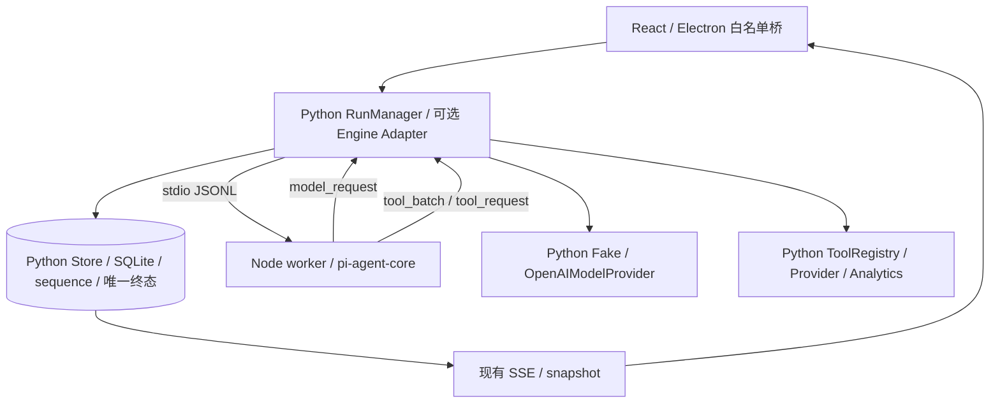

# 第二阶段 P2-01：pi 渐进式迁移架构决策

日期：2026-10-10（Asia/Shanghai）。决策状态：**架构建议已形成，接入实现尚未验证**。工程测试见 [基线](PHASE2-BASELINE.md)。本轮不替换/删除 Python AgentRunner，不改变公开 API、数据库或桌面业务。

## 1. 结论与当前调用链

建议先验证 **可选 Node 子进程 + pi-agent-core + 自建 JSONL 桥 + Python 业务主控**。迁移 pi 的通用工具循环和内存消息编排，保留 Python 模型传输、工具校验/执行和全部持久业务。可行性的源码依据存在，但不等于包已安装或 Windows 成品已运行。

当前已从源码确认：

```text
SessionPanel.execute
  → preload.startAgentRun / runs:agent
  → main/index.ts → BackendManager.startAgentRun
  → POST /sessions/{session_id}/runs → app.py:start_run
  → RunManager.start → Store.begin_agent → owned worker
  → AgentRunner.run → RuleDialog 或 OpenAIModelProvider.complete
  → 整批工具请求校验 → ToolRegistry.decode/execute → Python Provider/Analytics
  → RunManager.emit → Store.append_running
  → RunManager.settle → Store.finish（唯一终态）
  → app.py:stream_events → main/RunSubscription → preload
  → SessionPanel：先快照、后订阅、按 run/sequence 合并显示
```

核心路径：`services/backend/research_trail/{app,agent,model_provider,openai_provider,tools,capabilities,lifecycle,store,database}.py`；桌面 `apps/desktop/src/{main/backend.ts,main/run-stream.ts,main/index.ts,preload/index.ts,renderer/SessionPanel.tsx,renderer/session-adapter.ts}`。

研究是另一路：`ResearchService.plan/start/advance` → ProviderService 采集 → ResearchStore/事务检查点 → ReportService/报告合成/证据 → ResearchRecovery 显式恢复。`research.py`、`research_recovery.py`、`research_checkpoints.py`、`reports.py`、`report_synthesis.py` 不纳入首批通用 Agent 循环迁移。

## 2. pi 官方身份、版本与核查锚点

**本轮官方网络核实**：历史 `badlogic/pi-mono` 地址重定向至 [earendil-works/pi](https://github.com/earendil-works/pi)，官网 [pi.dev](https://pi.dev) 对应同一项目。官方包 author 字段为 Mario Zechner；不能继续只凭历史 `@mariozechner` 包名推断当前 API。

- GitHub latest release：[`v1.1.0`](https://github.com/earendil-works/pi/releases/tag/v1.1.0)，API 返回 published_at 为 `2026-10-07T22:26:31Z`，上海时间 2026-10-08 06:26:31；核查日为 2026-10-10。
- 固定源码提交：`abe508e1b89912adde45528136c3221eb69acdd7`（v1.1.0 解析结果）。main 当时为 `42a3497d03ad17e308a2299fa824727894f2c0ec`，不以 main 作为可复现依赖版本。
- npm `/latest` 元数据与固定源码 package.json 一致如下；未下载 tgz、未安装依赖。后续准备时必须再核实标签、registry integrity 与锁文件，不能使用无版本的 latest。

| 包 | 本轮 registry version / engines / license | 本项目用途 |
| --- | --- | --- |
| `@earendil-works/pi-agent-core` | 1.1.0 / Node ≥22.19.0 / MIT | 推荐候选：Agent、tool loop、内存 transcript、事件、AbortSignal |
| `@earendil-works/pi-ai` | 1.1.0 / Node ≥22.19.0 / MIT | core 的依赖，消息/流/校验类型；首批不启用其远程 Provider |
| `typebox` | core 固定直接依赖 1.3.27 | Node schema 承载；不能替代 Python Pydantic 最终校验 |
| `@earendil-works/pi-coding-agent` | 1.1.0 / Node ≥22.19.0 / MIT | CLI、SDK、官方 RPC；首批不引入 |
| `@mariozechner/pi-agent-core` | 旧命名 latest 0.73.1 / Node ≥20.0.0 / MIT | 历史兼容线，不与 1.1.0 API 混搭 |

包元数据来源：[core 1.1.0](https://registry.npmjs.org/@earendil-works%2fpi-agent-core/1.1.0)、[ai 1.1.0](https://registry.npmjs.org/@earendil-works%2fpi-ai/1.1.0)、[coding 1.1.0](https://registry.npmjs.org/@earendil-works%2fpi-coding-agent/1.1.0)、[旧 core](https://registry.npmjs.org/@mariozechner%2fpi-agent-core/0.73.1)。

固定 upstream 源码来源（均只读，未导入项目）：

| 来源 | 已确认内容 |
| --- | --- |
| [agent.ts](https://github.com/earendil-works/pi/blob/abe508e1b89912adde45528136c3221eb69acdd7/packages/agent/src/agent.ts) | `new Agent({initialState, streamFn, toolExecution, beforeToolCall, ...})`、`prompt`、`subscribe`、`abort`、`waitForIdle`；默认并行；异步事件监听参与等待 |
| [agent/types.ts](https://github.com/earendil-works/pi/blob/abe508e1b89912adde45528136c3221eb69acdd7/packages/agent/src/types.ts) | StreamFn、AgentTool.execute、AgentToolResult、AgentEvent；StreamFn 失败需编码为 error/aborted stream，不能简单 reject |
| [agent-loop.ts](https://github.com/earendil-works/pi/blob/abe508e1b89912adde45528136c3221eb69acdd7/packages/agent/src/agent-loop.ts) | 参数校验、tool hook、顺序/并行执行；tool_execution_start 早于 prepareToolCall；工具错误可能回给模型继续循环 |
| [stream-fn.ts](https://github.com/earendil-works/pi/blob/abe508e1b89912adde45528136c3221eb69acdd7/packages/agent/src/stream-fn.ts) | 缺省 streamFn 未配置会报错，宿主可显式注入，不必使用官方远程 Provider |
| [ai/types.ts](https://github.com/earendil-works/pi/blob/abe508e1b89912adde45528136c3221eb69acdd7/packages/ai/src/types.ts) | assistant content blocks、toolCall arguments object、toolResult、stopReason/usage；与当前 Chat Completions 字典不同 |
| [event-stream.ts](https://github.com/earendil-works/pi/blob/abe508e1b89912adde45528136c3221eb69acdd7/packages/ai/src/utils/event-stream.ts) | AssistantMessageEventStream，可给自定义非网络 streamFn 承载已完成模型响应 |
| [validation.ts](https://github.com/earendil-works/pi/blob/abe508e1b89912adde45528136c3221eb69acdd7/packages/ai/src/utils/validation.ts) | TypeBox schema 校验有类型转换路径，不能当作 Python 严格参数语义等价证明 |
| [RPC 文档](https://github.com/earendil-works/pi/blob/abe508e1b89912adde45528136c3221eb69acdd7/packages/coding-agent/docs/rpc.md) / [rpc-types.ts](https://github.com/earendil-works/pi/blob/abe508e1b89912adde45528136c3221eb69acdd7/packages/coding-agent/src/modes/rpc/rpc-types.ts) | 官方 CLI stdin/stdout JSONL；命令回执不等于运行完成；未发现通用 tool_result 注入命令 |
| [SDK sdk.ts](https://github.com/earendil-works/pi/blob/abe508e1b89912adde45528136c3221eb69acdd7/packages/coding-agent/src/core/sdk.ts) | createAgentSession 可 customTools/inMemory；默认构造 SessionManager、ResourceLoader、认证/模型 runtime，需要主动抑制额外状态与资源加载 |
| [ai/index.ts](https://github.com/earendil-works/pi/blob/abe508e1b89912adde45528136c3221eb69acdd7/packages/ai/src/index.ts) / [openai provider](https://github.com/earendil-works/pi/blob/abe508e1b89912adde45528136c3221eb69acdd7/packages/ai/src/providers/openai.ts) | core 入口与 Provider 分开，OpenAI Provider 可读取环境 key；首批显式 streamFn、不创建 Provider/认证/compat runtime |

源码 agent.ts 的 raw 与 GitHub Contents API 解码字节一致，blob `ee8e6e59140b75a90d9afa0c4ef532465b2fc793`。浏览页行数/渲染缓存可能不同，后续以固定 SHA 内容与包锁为准。

## 3. 方案比较与职责

| 方案 | 判定与原因 |
| --- | --- |
| 官方 `pi --mode rpc` 直接替换 Python | 不推荐。官方命令可以 prompt/abort/订阅，但没有任意 Python 工具结果回注命令；自定义工具还需可信 Node 扩展/额外桥。CLI 会话/资源/编码工具与本项目权威状态重叠 |
| coding-agent SDK + customTools + inMemory | 可作为后续备选；仍需清理默认 ResourceLoader/认证/会话设置/重试/压缩等行为，依赖更多，不是最小切口 |
| pi-agent-core + 自建 worker | 推荐做最小可证伪实验：明确注入 streamFn、只注册 Python 代理工具、无 CLI shell/文件工具和会话文件；错误与状态由 Python 裁决 |
| 仅迁移 pi-ai 的远程传输 | 另立后续任务。消息/端点/思考/重试/认证语义均要重验；当前 Python 传输已有协议边界，首批保留 |

**不是官方 RPC 新增了 model_request 或 tool_result API**；下文全部研迹协议名是建议自定义桥。只有表中 Agent/StreamFn/execute 等是已核实的 upstream API。

| 职责 | pi 可承担的范围 | Python 必须保留 |
| --- | --- | --- |
| 通用循环 | 本次运行内存 transcript、模型→工具→模型循环 | admission、提示词/技能业务判断、预算和最终答复校验 |
| 模型 | 自定义 streamFn 的消息转换；后续可评估多 Provider | 首批 OpenAIModelProvider 请求、配置快照、凭证、思考参数、HTTP 限制/取消 |
| 工具 | AgentTool.execute 发起桥请求 | 唯一注册表、参数/整批校验、工具与数据服务、Decimal 计算、结果校验 |
| 会话/运行/事件 | 无业务库；内存状态仅执行缓存 | ID、开始/终态、顺序、SQLite、快照、SSE、脱敏/审计 |
| 研究/证据/评测 | 首批不接管 | ResearchService/Store、报告版本/证据、检查点/恢复、工程评测、研究质量和投资结果 |
| 桌面/UI | worker 不接触 renderer | Electron 管桌面/后端；renderer 只显示 Python 权威缓存；图表/热力图是后续 UI 阶段 |

## 4. 最小适配边界（架构建议，尚未实现）



生命周期优先由 Python 创建一个每 run 的 worker，第一版不做进程池，避免运行间消息/凭证残留。开发环境只接受显式配置的绝对 node.exe 和 worker 路径；生产必须随包提供或经专门验证复用 Electron helper，不能依赖用户 PATH。Python 不给 worker 数据库路径/启动令牌/密钥。

建议 Python Engine 兼容现有 runner.run 的 `text, emit, stop, deadline, before_tool, after_tool` 与 AgentOutcome；RunManager.timeout 当前读取 `runner.model.label`，薄适配器需保持该字段或在后续任务显式改为统一 label。现有 ModelProvider 的 plan/respond 不能直接误称新接口。首批保留 Python AgentRunner 原路径，Engine 开关是内部执行策略，不新增 StartRun.kind：当前 DTO/Store 只接受 fixture/fake_agent/openai_agent。

### 4.1 建议桥协议

公共 envelope：`protocol_version=1, request_id, run_id, attempt_id, type, payload`；attempt_id 为运行内临时执行身份，不新增数据库列。每 worker 一次 start；Python 创建身份，校验来件属于当前 pipe/run/attempt。命令请求与响应 request_id 唯一，重复/未知响应、跨 run 或 attempt、未知类型拒绝。

| 方向 / type（自定义） | 最小 payload / 行为 |
| --- | --- |
| Node→Python `ready`，Python→Node `start` | ready 含协议/pi版本；start 含本次输入、Python 构建的系统上下文、只读工具定义、模式与预算；不传历史/私密资料/key |
| Node→Python `model_request` / Python→Node `model_response` | bounded transcript，经 Python 验证消息/工具关联与声明后传给现有 complete；响应仅允许字段/脱敏文本。首批 Fake/MockTransport；真实传输另行授权验证 |
| Node→Python `tool_batch` / Python→Node `batch_permit` | 整批原始参数、ID、wire name；Python 全批校验、预算预留、发绑定本批 digest 的临时 permit。任一非法则全批零执行 |
| Node→Python `tool_request` / Python→Node `tool_result` | permit + ordinal + 模型 tool_call_id + wire name；Python 比较原批准参数并重新验权，生成业务 call_id、发事件、执行工具、验证并保存结果再响应。重复请求不得重执行，返回已保存结果或明确拒绝 |
| Node→Python `engine_end` / `engine_error` | 仅候选最终文本/规范错误码，不含业务终态和 sequence；Python 检查最终答案、无未决操作、存储状态，随后 settle |
| Python→Node `cancel` / `shutdown` | cancel 触发 Agent.abort、结束待决桥请求；关闭 stdin 及退出超时兜底。Python 可先裁定终态，晚消息全部丢弃 |

LF 分帧的 UTF-8 字节流，兼容 CRLF 和分块多字节；不以 U+2028/U+2029 分帧。stdout 只协议、stderr 单独持续读取并限长脱敏；两端写入尊重 backpressure，读与工具/model工作分离，不能读线程阻塞在工具上导致 cancel 饿死。必须有消息大小、待决数、启动、单次响应、总运行和退出时限。

建议 bridge 上限单帧 1MiB UTF-8（超限失败，不截断合法 JSON）；模型上下文仍遵守现有 1MiB 预算，封装超出上限时明确拒绝；模型响应仍 256KiB、参数仍 4096 字符、最终答复仍 4000 字符。工具 DTO 不允许为迁就桥而丢字段；若现有 DTO 不能完整传输，阻止灰度，独立评估大小契约。

### 4.2 模型/工具兼容的硬约束

1. Python system/user → pi 消息；assistant `tool_calls` 字符串参数 → pi `content[{type:toolCall,...}]`；Python `role=tool/tool_call_id` ↔ pi `toolResult/toolCallId`。wire name 只通过 Python 的点号→下划线映射反解。文本工具结果与 details 保留同一 ToolSuccess/Failure 数据；pi structuredContent 不自动发给模型，不能把证据只放那里。
2. **在 Node JSON.parse 丢失重复键之前**，Python 模型网关按 agent.py 现有规则校验原始 arguments 字符串与全批。后续对其他 Node 模型源必须携带 raw arguments；仅解析后的对象不能证明重复字段保护。首批不启用 Node 直连模型。
3. streamFn 将 Python 完成响应封装为 AssistantMessageEventStream。模型请求错误/abort 变协议 error/aborted，usage 未知不能编费用；不引入历史上下文、自动重试、压缩、steering/followUp。Python 确定性技能查询/不可用拒绝仍在 Python 预处理。
4. Node 显式 `toolExecution:'sequential'`。整批 permit 必须在首个 execute 前拿到；pi schema 只为内部一致性，Python 根据原批准数据执行。TypeBox 的转换不得放宽业务参数。
5. Python 计数最多默认 8 轮/8 总调用：整批超限零执行；预算用尽后仍可接受最终无工具回复。Python 还限制异常循环的模型请求数/整体时间，不能把工具8次误写成只有8次模型请求。
6. pi 的原始 tool_execution_start 不直接写业务 tool_started；只有 Python 校验与执行门槛通过才写。工具失败首批沿用现有失败终止策略，不能因 pi 默认错误回传而追加模型重试；后续请求必须先通过 Python admission。

### 4.3 事件、取消、恢复与数据模式

| 行为 | 兼容决策 / 尚需验证 |
| --- | --- |
| SSE/序号 | Python Store 是唯一 sequence 分配者，继续协议版本1/事件类型。pi message/tool lifecycle 只作执行观察，禁止透传 envelope/时间/终态 |
| 文本 | 第一版缓冲完整最终答复，经4000字符/脱敏验证后用现有 settle 保存；不会把每轮 planning/thinking 变 UI 回复。token streaming 是另一步，需要避免 Store.finish 二次追加 |
| 取消/超时 | RunManager/Store 先保存唯一终态，再 stop/abort 子进程/模型/工具；工具 timer 包含桥等待但不能覆盖模型阶段。退出清理需等待，迟到 tool_result/engine_end 不追加 |
| 失败 | malformed JSON、EOF、版本不匹配、子进程 crash、未知工具、错误结果、预算耗尽、startup timeout 区分固定安全错误码。不得记录原 stderr/堆栈/key |
| 重放 | GET snapshot/event-log/SSE 仅读 SQLite；不启动 worker、不调模型/工具。RPC 重发与业务事件重放不同，不能凭同 ID 重复执行 |
| 检查点 | 研究仍用同事务 checkpoint/hash/generation/config identity；本次 pi 内存 transcript 不是业务检查点。通用会话中断后标 interrupted/重新发起，不承诺进程级续跑 |
| 模式 | 模型 fake/real 与行情 simulated/real 分开。Python tool definitions、provider revision/identity、result provenance 决定来源；worker 不切模式、不把真实失败替换 fixture |

## 5. 灰度与失败回退（建议）

- 默认 `python`。建议仅开发/测试启动配置 `python` / `pi-offline`；新开关当前不存在。生产 packaged-launch 继续拒绝环境覆盖；生产灰度以后由 Python 的受控策略决定，独立授权设计，不以环境变量暗开真实模型。
- 只有已完成版本握手、兼容/安全/离线测试的 engine 才可 admission；切换仅作用于下一次 run，不更换进行中的 run。
- **运行开始前且未发模型/工具请求**：可在明确的“允许预检回退”策略下选择现有 Python runner，并展示/记录原因。显式选择 pi 的验收必须失败可见，不能悄悄通过 Python 代跑称 pi 成功。
- **运行已开始或外部请求是否发出不确定**：保存 failed/timed_out/interrupted 等实际状态，保留已提交证据，禁止在同一 run 自动再用 Python 完整重跑，避免重复请求/费用。用户显式重新发起下一次 Python run。
- 关闭 pi 策略后无需改库、转换历史、删除事件或 uninstall；Python AgentRunner 保留且原完整回归通过。开关缺失/无 worker 的默认启动应与现有一致。

## 6. 安全、许可、依赖与 Windows 包装

**源码确认**：官方 pi 不自带限制文件/进程/网络/凭证的权限沙箱。只读 tool allowlist 限制模型动作，但不隔离被攻陷的 Node 包；需要依赖可信审计，强隔离需另评估 Windows OS 边界。

首批 worker 环境采用系统变量白名单，不继承 key/token/proxy/NODE_OPTIONS/RESEARCH_TRAIL_TOKEN/DB_PATH；不创建 AuthStorage/ModelRuntime，不读取 ~/.pi 或项目扩展/技能/AGENTS，不暴露 bash/read/write/edit，不接收脚本或任意路径。Node 不传 key，Python 使用现有 Windows CredentialVault、HTTPS/loopback 明文例外、无代理/重定向/自动重试及脱敏响应。此方案仍会把本次工具事实放入 Node 内存，应按敏感数据处理。

许可依据：[pi 固定 MIT](https://github.com/earendil-works/pi/blob/abe508e1b89912adde45528136c3221eb69acdd7/LICENSE)；[Node v24.19.0 LICENSE](https://github.com/nodejs/node/blob/v24.19.0/LICENSE)。pi 顶层与三包声明 MIT，可分发时保留原版权/许可；Node 自身及其嵌入依赖有多份条款，必须随实际二进制保留完整声明。pi MIT 不把研迹、Folio、SDK 或全部间接依赖统一变 MIT；当前项目既有来源边界继续有效。

依赖与体积事实（npm registry 的 unpackedSize；不是安装包实测）：core **268,663B**，ai **4,086,201B**，两包约 **4.15MiB**；coding-agent 自身 **22,924,895B**。都不含各自完整传递依赖、Node、重复资源和压缩效果。core 依赖 ai/typebox；ai 依赖 OpenAI、Anthropic、Google、AWS Bedrock、Smithy、代理包、partial-json、telemetry 等。即使只用 core 的自定义 streamFn，锁定安装闭包仍需审计；tree-shaking 不等于供应链消失。

后续依赖准备应固定 core/ai 1.1.0、完整 lock/integrity，收集实际 bundled 许可证/SBOM，审查新增可执行脚本/原生依赖；首批 worker 不导入 Provider/compat/OAuth/远程 catalog，import 零网络需用离线护栏实测。无本轮已完成漏洞/许可闭包或安装大小结论。

Windows 包装约束：

1. 现有 PyInstaller onedir 只打 Python，不能自动包含 node.exe/ESM worker；后续 worker 独立 `resources/pi-worker`，运行时 `resources/node/node.exe` 等仅为建议目录，不是现有资源。
2. 优先评估独立 Node 24.19.0 与 ESM bundle，满足 pi engines，但增加二进制和更新面；Electron 内置 Node 本机为24.21.0，可研究 `utilityProcess` 或 helper 减少体积，必须另验 fuses/RUN_AS_NODE、生命周期、权限与打包；不因版本满足就宣称可用。
3. 当前打包器只带 bundled dist/backend/skills/notices，没有仓库 node_modules；需要将 worker bundle/精确依赖资源和许可显式加入 manifest、hash、构建身份。执行文件不能在 ASAR 内，路径按资源根解析，不能依赖 cwd、用户 Node/Python、npx/bun/npm 动态安装。
4. Python 退出/崩溃后新增孙进程可能遗留，现有只清理直接 Python 子进程不证明 worker 被清理。worker 监听父 stdin EOF、abort/shutdown、有界 terminate；冻结后端需处理 `sys.executable` 指向自身、隐藏窗口、Windows Job Object/实际子树清理等候选，严禁按进程名全局杀。
5. 必验非 ASCII/空格安装路径、标准用户、System32 cwd/PATH无Node、生产变量毒化、正常/强制退出、重启历史、卸载保留个人数据。开发通过后才能申请新候选打包；本轮没有新安装器或新的干净Windows证据。

## 7. P2-02 建议：第一层可实施任务与验收

只做 **离线协议与最小 pi worker 实验**，不自动切换现有 UI/Agent、不处理 K线/热力图、不接研究恢复/报告、不发真实请求。

建议拆为两道可检查门槛：

1. **协议/生命周期门槛（可在现有依赖下开始）**：新增独立 Python bridge、Node stub worker、消息边界/请求关联/批次许可/终态竞态测试；FakeModel 与 fixture 的一次 quote 工具回传。内部实验入口直接创建隔离 Store/RunManager，保持公开 StartRun kind/契约/DB不变。
2. **实际 pi 门槛**：下一轮任务明确允许准备锁定依赖后，接 core 1.1.0 的 Agent + Fake streamFn + Python 代理 tool，运行同一协议样例并记录 package identity。若仍禁止安装且本地无 pi，只可验 stub，必须写“实际 pi 受阻”，不标 P2-02 整体通过。没有直接调用 npm/npx 下载运行的捷径。

建议新增位置（未创建）：`services/backend/research_trail/pi_bridge.py`、独立 worker 目录（例如 `packages/pi-worker`）、Python/Node 专项测试；必要时提取 agent.py 的纯校验 helper 供两引擎复用，必须保留原回归语义并由下一步明确授权。现有 `RunManager` 是挂接点，现有 AgentRunner 为默认与回滚路径。

具体验收标准：

| 验收 | 达标证据 |
| --- | --- |
| 真实 pi 身份 | 已安装锁定1.1.0、import实际 core、Fake streamFn；纯 stub 不算此项 |
| 工具链一致 | AAPL.US fixture 参数、数值、来源/时间同 Python；Python handler 一次，ToolSuccess 卡片契约不变 |
| 非法批次零执行 | 未知工具/重复字段/重复ID/额外参数/第二个非法调用/8次边界：全部先校验，非法全批零 handler；未校验数据不入事件 |
| 消息/输运 | Unicode/分块/CRLF/多帧/超限/坏JSON/重复或跨run response/读写backpressure，错误明确、无死锁 |
| 生命周期 | 取消、tool timeout、run timeout、worker crash/EOF/startup timeout、迟到事件三方竞争：仅一个终态与一对 message_completed/run_completed，事件序号连续 |
| 重放与恢复边界 | snapshot/SSE重连/重启只读，model/tool调用计数不增加；原研究恢复回归不变 |
| 安全 | worker无凭证/DB令牌、无默认编码工具/资源autoload；反射秘密、stderr泄密探针脱敏；外网socket/DNS零成功 |
| 默认与回滚 | 无pi/开关关闭完整Python原路径通过；显式pi失败可见；已开始run不自动再跑Python |
| 现有工程门槛 | `bun run verify` 全套通过；contract check而非generate；无数据库迁移/个人库/新真实请求 |

离线 CI 改动属后续授权：依赖准备和验收分离，缓存/锁定准备后离线运行pi专项；缺 pi 明确失败/受阻，不静默跳过关键项。P2-02 不承担新安装包发布，Windows worker 分发须后续专门验收。

## 8. 尚未验证清单与停止条件

尚未实测：pi包运行、ESM打包、动态schema兼容、协议适配、整批许可、取消进程树、原有评测与pi结果等价、Node分发闭包/体积/升级、第三方漏洞状态、真实模型适配及质量。源码表明挂接点存在，不代表这些风险已解决。

若协议不能保持 Python 唯一终态/零重执行/整批零执行保护，或需双写业务状态才能工作，停止该路线并记录反例，保留 Python 默认。P2-01 文档交付后立即停止；后续实现、依赖准备、真实验证和发布均依用户下一步范围执行。
